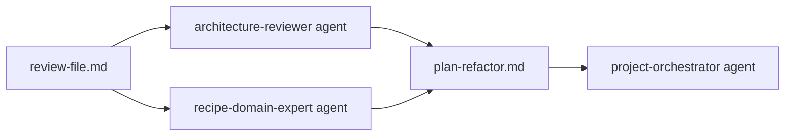
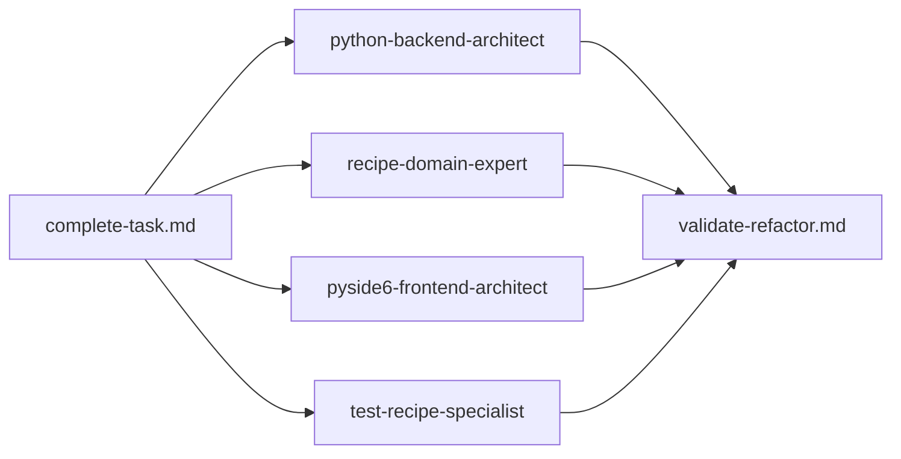
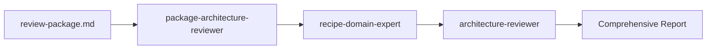

# MealGenie Command System - Agent Coordination

## Command Workflow & Agent Coordination

### 1. Code Review Workflow


**review-file.md**: Uses **architecture-reviewer** for MVVM boundary validation and **recipe-domain-expert** for recipe business logic analysis.

**plan-refactor.md**: Uses **project-orchestrator** to coordinate specialized agents based on review findings.

### 2. Implementation Workflow  


**complete-task.md**: Coordinates Core layer (python-backend-architect + recipe-domain-expert) and UI layer (pyside6-frontend-architect) implementations.

**validate-refactor.md**: Uses **architecture-reviewer**, **test-recipe-specialist**, and **recipe-domain-expert** for final validation.

### 3. Package Analysis Workflow


**review-package.md**: Holistic package analysis across MVVM layers with recipe domain focus.

### 4. Specialized Workflows

**feature.md**: 
- **project-orchestrator** for planning
- **recipe-domain-expert** for business logic
- **python-backend-architect** for Core layer
- **pyside6-frontend-architect** for UI layer

**error.md**: 
- **architecture-reviewer** for MVVM violations
- **recipe-domain-expert** for recipe-specific errors

**organize-file.md**: 
- **code-refactor-simplifier** for complex logic
- **recipe-domain-expert** for documentation

## Agent Specialization Matrix

| Command | Primary Agent | Secondary Agents | Focus |
|---------|---------------|------------------|-------|
| review-file | architecture-reviewer | recipe-domain-expert | MVVM + Recipe Domain |
| plan-refactor | project-orchestrator | All specialists | Task Coordination |
| complete-task | (Multiple) | All as needed | Implementation |
| validate-refactor | architecture-reviewer | test-recipe-specialist, recipe-domain-expert | Validation |
| review-package | package-architecture-reviewer | recipe-domain-expert, architecture-reviewer | Holistic Analysis |
| feature | project-orchestrator | recipe-domain-expert, architects | Feature Creation |
| error | architecture-reviewer | recipe-domain-expert | Error Resolution |
| suggest-tests | test-recipe-specialist | architecture-reviewer | Test Coverage |
| ui-consistency | pyside6-frontend-architect | architecture-reviewer | UI Patterns |
| organize-file | code-refactor-simplifier | recipe-domain-expert | Code Organization |
| check-layers | architecture-reviewer | recipe-domain-expert | Boundary Validation |

## MealGenie-Specific Improvements

### Recipe Domain Focus
- All commands now reference recipe management, meal planning, and shopping list workflows
- Agent assignments prioritize recipe domain expertise
- Error patterns specific to recipe data and ingredient handling

### MVVM Architecture Emphasis
- Clear UI→Core import boundary enforcement
- ViewModels as mandatory intermediation layer
- Data flow validation: Models → DTOs → ViewModels → Views

### Agent Coordination
- Commands specify primary and secondary agents
- Clear delegation strategies for different architectural layers
- Specialized agents for recipe domain vs general architecture

### Cross-Command Integration
- Commands reference related commands for workflow continuation
- Consistent terminology and patterns across all commands
- Agent coordination flows seamlessly between commands

## Usage Examples

### Complete Code Review Workflow
```bash
/review-file @app/ui/views/recipe_browser/recipe_browser_view.py
# Creates review file, uses architecture-reviewer + recipe-domain-expert

/plan-refactor @.claude/reviews/review-recipe_browser_view.md  
# Uses project-orchestrator to create refactoring plan

/complete-task @.claude/tasks/2024-12-05-plan-recipe_browser_view.md
# Coordinates multiple agents for implementation

/validate-refactor @.claude/tasks/2024-12-05-plan-recipe_browser_view.md
# Final validation with architecture-reviewer + test-recipe-specialist
```

### Package Analysis Workflow
```bash
/review-package app/ui/views/add_recipes/
# Uses package-architecture-reviewer for holistic analysis

/check-layers @app/ui/views/add_recipes/add_recipe_view.py
# Uses architecture-reviewer for MVVM boundary validation
```

This coordinated approach ensures consistent, comprehensive analysis of MealGenie's recipe management architecture with proper agent specialization.